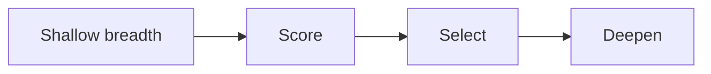

# Beyond the Nearest Peak, Applied to Coding Agents

Agents make it cheap to generate patches. They do not make it cheap to know which patch deserves to survive.

| Framework position | Value |
|---|---|
| Skill | `/solution-space` |
| Run after | `/problem-statement` |
| Produces | solution-level comparison and selected level |
| Feeds | `/execute`, evidence, and the agent brief |

That is the shift from `Beyond the Nearest Peak`: use the model for shallow breadth, score options with human judgment, select the level, then spend depth.

## The bad pattern

> Bad pattern: prompt → first plausible patch → tests pass → merge.

That can work for tiny tasks. It is a bad default for real project improvement.

The first workable patch is often the nearest peak:

- it compiles;
- it suppresses the symptom;
- it looks reviewable;
- it leaves the underlying problem intact.

Cheap generation removes the excuse for stopping there.

## The levels

| Level | What it does | When it is right | Failure mode |
|---|---|---|---|
| Band-Aid | Suppresses the symptom. | Incident, deadline, small blast radius. | Becomes the fourth patch on the same wound. |
| Local Optimum | Improves the current design. | The framing is right; the implementation is messy. | Cleaner version of the wrong shape. |
| Reframe | Changes the problem statement. | The symptom points to a hidden constraint or ownership issue. | Endless analysis if no testable slice follows. |
| Redesign | Changes the system so the problem is harder to create. | The class of failure keeps recurring. | Big rewrite with weak feedback. |

Choose the altitude deliberately: Band-Aid, Local Optimum, Reframe, or Redesign. Name why that level fits the aim and evidence.

## Scoring function

Before deepening a path, score it against the same criteria:

- Does it move the aim?
- Can we test it?
- Can a reviewer understand it?
- Is it reversible?
- What is the blast radius?
- What maintenance burden does it add?
- Does it remove a class of failure or only hide one instance?
- What would prove this path was wrong?

Breadth without a scoring function is noise.

## How this shows up in the tutorial

When `/solution-space` runs, require at least one option at each level:

1. Band-Aid;
2. Local Optimum;
3. Reframe;
4. Redesign.

Then prune.

Do not ask the agent to deepen all four. That creates option debt. Pick one path, write checks for it, and run a bounded implementation.

## Good signs

- You reject at least one plausible option.
- The selected option names its level.
- The brief says why other levels were rejected.
- The acceptance checks match the selected level.
- Dissent can challenge whether the chosen level was too low or too high.

## Bad signs

- The first suggested patch becomes the plan.
- Every option is just a different implementation of the same idea.
- The agent compares syntax instead of problem framing.
- The scoring criteria change per option.
- Redesign is chosen because it sounds serious, not because the recurrence justifies it.

## Exercise

Before `/execute`, produce four options:

1. Band-Aid.
2. Local Optimum.
3. Reframe.
4. Redesign.

Score them with the same criteria, select one, and write why the other three were rejected. If every option is just a different implementation of the same framing, you have not searched the solution space yet.

## Go deeper

- [Beyond the Nearest Peak](https://muness.com/posts/beyond-the-nearest-peak/) — the source essay for shallow breadth, score, select, deepen.
- [`docs/problem-statement.md`](problem-statement.md) — the selected framing that solution search must respect.
- [`docs/evidence-and-evals.md`](evidence-and-evals.md) — how to make the selected solution testable.
- [`docs/agent-briefs.md`](agent-briefs.md) — where the selected level becomes execution context.

---

## Navigation

- Previous: [Problem Statement](problem-statement.md)
- Up: [Docs Home](index.md) / [Curriculum](curriculum.md)
- Next: [Evidence and Evals](evidence-and-evals.md)
