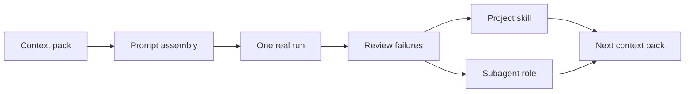

# Context to Agent Tutorial

Use this tutorial when a one-off prompt starts becoming an interface the next session should reuse.

The main tutorial teaches the whole Open Horizons loop. This path teaches one narrower composition: turn selected context into a checkable prompt, then decide what should become a skill and what should become a subagent.

The rule is simple: context stays current, prompts assemble the current request, skills preserve repeated procedures, and subagents preserve bounded roles.

## Use this when

- the same prompt shape keeps coming back;
- the agent keeps needing the same local checklist;
- reviewers need to see what context was supplied and why;
- a role should not inherit the main chat's reasoning;
- a future session should run the workflow without rediscovering it.

Skip this path when the work is genuinely one-off. A single useful prompt is not a skill yet.

## Inputs

Bring one real project slice and these starting artifacts:

| Input | Source | Why it matters |
|---|---|---|
| Intent | [Intent Engineering](intent-engineering.md) | Names the outcome the interface should serve. |
| Model fit | [Model-Fit Framing](model-fit.md) | Names the language operation the model should perform. |
| Context pack | [Context Construction](context-construction.md) | Supplies selected facts, provenance, constraints, and stop triggers. |
| Evidence expectation | [Evidence and Evals](evidence-and-evals.md) | Keeps the prompt from becoming fluent but unverifiable. |

## Step 1: Build the context pack

Read [Context Construction](context-construction.md), then use [`templates/context-pack.md`](../templates/context-pack.md).

The context pack is the dynamic input to the rest of the path. Keep it current and inspectable:

- task identity;
- selected files, transcripts, docs, or decisions;
- provenance and authority;
- hard constraints and soft preferences;
- assumptions to test;
- stop, dissent, and salvage triggers.

Do not hide project facts inside a skill or subagent. If the fact can go stale, it belongs in the context pack.

## Step 2: Assemble the prompt

Read [Prompt and Context Assembly](prompt-and-context.md), then use [`templates/prompt-assembly.md`](../templates/prompt-assembly.md).

Separate the layers:

| Layer | Question |
|---|---|
| Stable instruction | What rule or behavior should survive across runs? |
| Dynamic context | What current facts does this run need? |
| Examples | What behavior needs to be made concrete? |
| Output contract | What shape must come back? |
| Fixtures and reviewer checks | How will failure be caught? |

Run the prompt once before promoting anything. A prompt that has not failed under review has not taught you what should be preserved.

## Step 3: Decide what repeats

After the run, review what was repeated and what was current.

| If this repeats... | Preserve it as... | Because... |
|---|---|---|
| inspection sequence, checklist, command order, evidence gate, stop condition | project skill | the workflow should survive the chat. |
| independent reviewer, scout, implementer, extractor, domain validator | subagent | the role needs its own context and output contract. |
| file paths, current decisions, transcript excerpts, one customer's constraints | context pack | the facts can go stale. |
| one assembled request for one slice | prompt assembly | the shape has not proved reusable yet. |

This is the handoff from prompt authoring to skill and subagent authoring.

## Step 4: Promote a workflow to a skill

Read [Authoring Skills](authoring-skills.md), then use [`templates/project-skill.md`](../templates/project-skill.md).

Promote only the reusable procedure:

- trigger;
- what to inspect;
- constraints that change behavior;
- stop conditions;
- evidence required;
- output shape.

Leave run-specific facts behind. The next invocation should combine the skill with a fresh context pack.

## Step 5: Split a role into a subagent

Read [Authoring Subagents](subagents.md), then use [`templates/subagent.md`](../templates/subagent.md).

Create a subagent only when a role boundary improves the work:

- the reviewer should not inherit the implementer's reasoning;
- a scout needs to inspect many files without flooding the main context;
- a specialist needs a narrow tool set;
- parallel work needs independent outputs;
- a phase gate needs a cold answer.

If the subagent needs the whole chat to function, the role boundary is not clear enough.

## Step 6: Check the composition

Before calling the interface reusable, answer these checks:

| Check | Pass condition |
|---|---|
| Context stays current | Stale project facts live in the context pack, not the skill or subagent. |
| Prompt is checkable | The assembled request has success criteria, output contract, and failure cases. |
| Skill is procedural | It preserves a repeated workflow, not generic advice. |
| Subagent is bounded | It has a clear input contract, tool boundary, stop condition, and output shape. |
| Next session can run it | A future agent can combine fresh context with the preserved procedure or role. |

## Output

By the end, you should have:

- context pack;
- prompt assembly;
- notes from one real run;
- project skill, if the workflow repeated;
- subagent, if the role boundary was real;
- review note explaining what stayed dynamic and what was promoted.

## Navigation

- Previous: [Tutorial](tutorial.md)
- Up: [Docs Home](index.md) / [Curriculum](curriculum.md)
- Next: [Context Construction](context-construction.md)
