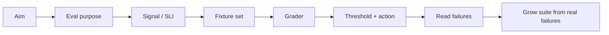

# Eval Tutorial

Use this tutorial when “the agent passed” is not enough evidence.

The builder loop already asks for evidence before delegation. This path goes deeper: turn a vague check into a small eval suite with a purpose, fixtures, grader, threshold, and action policy.

## Use this when

- a prompt, workflow, or agent behavior will be reused;
- passing one manual check would create false confidence;
- a model grader or rubric is being considered;
- the team disagrees about what “good” means;
- production failures or review findings should become repeatable cases;
- recommendations or suggestions can be judged by app state, workflow completion, or user acceptance instead of another LLM.
- a change needs a quality bar, not just a yes/no test.

Skip this path when a normal regression test or manual reproduction is enough.

## Step 1: Name fitness for purpose

Read [Evidence and Evals](evidence-and-evals.md), then use [`templates/eval-checklist.md`](../templates/eval-checklist.md).

Borrow the SLO framing: quality only makes sense relative to the purpose the output serves.

| Question | Example |
|---|---|
| Who relies on this behavior? | Maintainers changing notification logic. |
| What decision or outcome should the eval protect? | Duplicate prevention moved to the send boundary. |
| What failure matters? | A patch suppresses one caller path while another still duplicates sends. |
| What is good enough for this slice? | Core idempotency cases pass and no unrelated timing behavior changes. |

Do not start by choosing a metric. Start by naming the user, maintainer, or system decision the eval is supposed to protect.

## Step 2: Choose the signal

Turn the purpose into an observable measure.

| SLO term | Eval term | Example |
|---|---|---|
| SLI | Observable signal | Same recipient plus same idempotency key produces one send and one duplicate-skip record. |
| SLO | Target threshold | All boundary-level duplicate cases pass. |
| Error budget | Tolerated failure | One flaky exploratory case can remain; core regression failure blocks delegation. |
| Policy | Action on miss | Stop implementation, inspect traces, revise framing or solution level. |

This is the part the framework was already doing implicitly through aim, mechanism, feedback, guardrails, review, dissent, and salvage. The eval tutorial makes it explicit.

## Step 3: Build a small fixture set

Start with a handful of cases. Mature eval guides consistently warn against vague or one-sided evals.

| Fixture type | What it catches |
|---|---|
| Happy path | The expected behavior works. |
| Old behavior / regression | The prior failure no longer passes. |
| Edge case | The boundary is real, not accidental. |
| Negative case | The system does not act when it should not. |
| Ambiguous input | The system asks, scopes, or reports uncertainty instead of guessing. |
| Conflicting evidence | The system reports conflict and authority instead of smoothing it over. |
| Instruction inside data | User or retrieved text cannot override stable instructions. |

A good fixture is unambiguous enough that two reviewers would make the same pass/fail call.

## Step 4: Pick the cheapest reliable grader

Prefer harness-executed outcome checks over transcript policing or offline LLM-as-judge. Valid solutions may take paths you did not predict, and recommendations are often judged by what the app or user does next.

| Grader | Use when | Watch out for |
|---|---|---|
| Code or state check | There is a clear pass/fail outcome. | Brittle checks that reject valid variation. |
| Harness-executed eval loop | The harness can run the workflow and inspect app, repo, trace, or state changes. | Simulated flows that miss production behavior or user context. |
| App or user signal | The model gives a recommendation, suggestion, route, or candidate action. | Implicit signals are noisy; high-risk decisions still need explicit review. |
| Human review | Judgment requires domain expertise. | Cost and inconsistency. Use it to calibrate other graders. |
| Model grader | The output is open-ended and cannot be judged reliably by harness, app/user signal, deterministic check, or calibrated human review. | Vague rubrics, grader drift, no “insufficient evidence” option. |
| Production signal | Real users and real conditions matter after shipping. | Reactive signals without a pre-ship regression suite. |

For recommendation systems and assistant suggestions, ask whether the system already has a judgment signal: accepted recommendation, edited suggestion, applied patch, completed workflow, corrected route, abandoned suggestion, or repeated user override. Those signals usually beat asking another LLM whether the suggestion looked good.

If a model grader is still needed, give it a rubric, examples, and a way to say the evidence is insufficient. Periodically compare it with human judgment and deterministic outcomes.

## Step 5: Set threshold and action

An eval without a decision rule becomes a dashboard. Define what happens when it fails.

| Result | Action |
|---|---|
| Core regression fails | Do not delegate or ship. Fix the behavior or revisit framing. |
| Edge fixture fails | Decide whether the edge is in scope; if yes, fix; if no, record residual risk. |
| Model grader and human disagree | Calibrate the rubric before trusting the score. |
| Production signal violates threshold | Spend the error budget deliberately: pause new work, inspect traces, or open a focused task. |

Avoid gold-plating. The SLO lesson is that 100% quality is neither always possible nor always worth the cost. Choose the bar that protects the purpose.

## Step 6: Read failures

Scores are not self-explanatory. Read traces, transcripts, outputs, and grader explanations.

A failure can mean:

- the agent failed;
- the prompt or context is unclear;
- the task is ambiguous;
- the grader is unfair;
- the eval used an offline model judge even though the harness or app could have checked the outcome;
- the harness hides production behavior;
- the selected solution level was wrong.

Feed real failures back into the suite. Review findings, dissent memos, production bugs, and salvage notes are high-value eval cases.

## Output

By the end, you should have:

- eval objective;
- fixture set;
- grader choice;
- harness-executed deterministic loop, if feasible;
- app or user judgment signal for recommendations and suggestions;
- threshold and action policy;
- traces or transcripts to inspect;
- residual risk;
- cases to add later when real failures appear.

## Source references

- [Implementing SLOs for Data Quality](https://muness.com/posts/implementing-slos-for-data-quality/) — SLI, SLO, error budget, policy, and fitness-for-purpose framing applied to quality.
- [OpenAI evaluation best practices](https://developers.openai.com/api/docs/guides/evaluation-best-practices) — objective, dataset, metrics, iteration, continuous evaluation, and anti-patterns.
- [Anthropic: Demystifying evals for AI agents](https://www.anthropic.com/engineering/demystifying-evals-for-ai-agents) — tasks, trials, graders, transcripts, outcomes, capability versus regression evals, and eval maintenance.
- [Anthropic eval cookbook](https://github.com/anthropics/anthropic-cookbook/blob/main/misc/building_evals.ipynb) — prompt, output, golden answer, score, and code/model/human grading methods.
- [Phoenix Iterative Evaluation & Experimentation Workflow](https://arize.com/docs/phoenix/cookbook/ai-engineering-workflows/iterative-evaluation-and-experimentation-workflow-python) — tracing, datasets, evaluators, experiments, and iterative improvement.

## Navigation

- Previous: [Evidence and Evals](evidence-and-evals.md)
- Up: [Docs Home](index.md) / [Curriculum](curriculum.md)
- Next: [Agent Briefs](agent-briefs.md)
