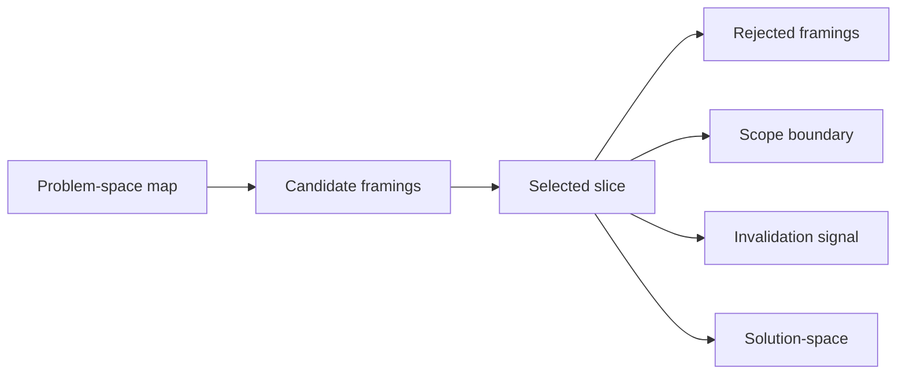

# Problem Statement

A problem statement narrows mapped terrain into the slice the agent is allowed to solve.

| Framework position | Value |
|---|---|
| Skill | `/problem-statement` |
| Run after | `/problem-space` |
| Produces | selected slice, rejected framings, scope boundary, invalidation signal |
| Feeds | `/solution-space`, evidence, and the agent brief |

Problem space asks, “What is going on?”
Problem statement asks, “Which part are we going to treat as the problem for this run, and what would prove that framing wrong?”

That narrowing matters because every downstream artifact inherits it. Solution search compares options inside the selected frame. Evidence checks the frame. The agent brief delegates against it. Review and dissent can reject the work when the implementation solves a different problem.

## Learn

A useful problem statement carries five things:

- the selected slice;
- who or what is affected;
- the mechanism causing the pain;
- the boundary of the current run;
- an invalidation signal.

A readable statement does three jobs:

| Part | What it names |
|---|---|
| Because | the mechanism causing the pain |
| This run | the slice and boundary for the current attempt |
| If | the evidence that would prove the framing wrong |

Write it as a sentence a maintainer can read. Use the parts as a check, not as a template to paste blindly.

## From terrain to slice

Start from the problem-space map and write three candidate framings:

1. **Symptom framing** — the visible bug, friction, or complaint.
2. **Systems framing** — the ownership, boundary, data flow, or invariant behind the symptom.
3. **Maintainer or user framing** — the behavior someone cannot safely perform today.

Example:

| Framing | What it says |
|---|---|
| Symptom | Notifications sometimes send twice. |
| Systems | Notification ownership is split across trigger paths, so no layer enforces idempotency. |
| Maintainer | Engineers cannot safely add notification behavior because ownership and duplicate prevention are not visible at the send boundary. |

Then choose one framing for the run.

The selected statement should name what you are choosing and what you are leaving out. “Notifications sometimes send twice” may be enough for an incident patch. “No layer enforces idempotency” points to a boundary fix. “Engineers cannot safely add notification behavior” points to maintainer workflow and architecture clarity.

Those are different runs.

## Artifact

Use [`templates/problem-statement.md`](../templates/problem-statement.md).

Produce a selected problem statement that preserves:

| Field | Why it matters |
|---|---|
| Selected framing | Names the problem this run will solve. |
| Rejected framings | Prevents old framings from sneaking back in. |
| Invalidation signal | Gives review and dissent a way to prove the framing wrong. |
| Scope boundary | Keeps execution from expanding silently. |
| Handoff to solution-space | Defines what solution levels should be compared. |

## What Good Looks Like

| Part | Example |
|---|---|
| Selected statement | Notification ownership is split across multiple trigger paths, so duplicate prevention depends on each caller remembering the same rule. This run will move duplicate prevention to the send boundary for the reminder-notification path and add a regression check for same-recipient, same-idempotency-key sends. |
| Rejected framing | Symptom-only duplicate-send fix: too narrow; it leaves the ownership boundary untouched. |
| Rejected framing | Full notification platform redesign: too broad for this slice; use dissent if the boundary fix exposes deeper recurrence. |
| Invalidation signal | If review finds only one trigger path can reach this send boundary, the systems framing is too broad and the fix should shrink. |

## What Good Does Not Look Like

> Problem statement: fix duplicate notifications.

That statement gives `/solution-space` no boundary, gives `/execute` permission to patch anywhere, and gives `/review` no way to tell whether the selected framing survived implementation.

## Review check

Reject the problem statement if:

- it only restates the symptom;
- it does not name the affected actor, system, or maintainer behavior;
- the mechanism is missing;
- the slice is too broad to execute and review;
- the rejected framings are not named;
- there is no evidence that could prove the framing wrong;
- `/solution-space` would still have to decide what problem to solve.

## Go deeper

- [`docs/problem-space.md`](problem-space.md) — the map this statement narrows.
- [`docs/beyond-nearest-peak.md`](beyond-nearest-peak.md) — how the selected statement changes the solution level.
- [`docs/agent-briefs.md`](agent-briefs.md) — where the selected statement becomes execution context.
- [Documenting Strategy](https://muness.com/posts/documenting-strategy-lessons-from-leading-data-and-eng/) — connected needs, strategy, tactics, and evidence.

---

## Navigation

- Previous: [Problem Space](problem-space.md)
- Up: [Docs Home](index.md) / [Curriculum](curriculum.md)
- Next: [Beyond the Nearest Peak](beyond-nearest-peak.md)
