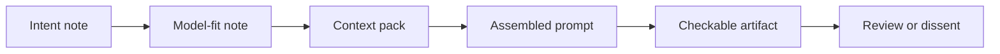

# Prompt and Context Assembly

Prompt engineering in this curriculum means assembling the request so the model can work over supplied reality instead of guessing missing reality.

Treat it as a slice through the first three modules, not a separate phase that replaces them. Intent names the outcome, model-fit names the language operation, context construction supplies the facts, and prompt assembly turns those pieces into one checkable request.

## The assembly

A useful prompt has more than wording. It carries the decision about what context belongs in the request and what the model must refuse to infer.

| Prompt part | Comes from | Job |
|---|---|---|
| Objective | Intent note | Say what behavior or decision this output should support. |
| Model job | Model-fit note | Name the operation: extract, compare, classify, rewrite, critique, generate candidates, or translate. |
| Supplied context | Context pack | Provide selected facts with provenance, not a repo dump. |
| Boundary | Context pack and problem framing | Mark what is in scope, out of scope, assumed, or unresolved. |
| Output contract | Model-fit note or downstream artifact | Say what sections, fields, evidence, and missing-context notes must come back. |
| Evidence check | Eval checklist or reviewer criteria | Give the reviewer a way to reject fluent but ungrounded output. |

## Assembly order

1. Start with the artifact you need back.
2. State the model job in one sentence.
3. Attach only the context needed for that job.
4. Name the constraints and what the model must not infer.
5. Require missing context to be surfaced explicitly.
6. Add the check a reviewer will use.

The prompt is ready when a reviewer can point to each included context item and explain why the model needs it.

## Example

| Version | Prompt |
|---|---|
| Weak | Summarize this meeting and tell me the action items. |
| Better | Using the transcript, attendee roles, active roadmap aims, prior decisions, and known guardrails in the context pack, produce a decision-preserving meeting note. Separate decisions, proposals, risks, action items, and missing context. Quote the transcript line or timestamp for every commitment. If ownership is ambiguous, list it under missing context instead of assigning an owner. |

The better prompt is longer because it carries the context boundary, output contract, and refusal behavior. It is still not a context dump: every supplied item has a job.

## Review check

Reject an assembled prompt if:

- it could be pasted into any company and still look complete;
- it asks the model to know facts not supplied;
- the context has no provenance;
- the output shape is vague;
- missing context has nowhere to appear;
- correctness can only be judged by vibes after the answer arrives.

## Go deeper

Source posts used for this slice:

- [LLM Prompt Types](https://muness.com/posts/llm-prompt-types/) — prompt authoring starts by choosing the kind of model-suited operation and pairing it with context and evaluation criteria.
- [Intent Engineering](https://muness.com/posts/intent-engineering/) — the prompt needs an outcome, not just an activity request.
- [The Context Stack](https://muness.com/posts/the-context-stack/) — data assembly for a prompt needs provenance, task identity, constraints, guardrails, and promotion paths; dumping more text is not the same as supplying context.
- [Alignment Is the Constraint](https://muness.com/posts/alignment-is-the-constraint/) — aim, mechanism, feedback, and guardrails belong in the request before speed helps.

Related curriculum pages and external mechanics:

- [`docs/intent-engineering.md`](intent-engineering.md) — produce the intent note that anchors the prompt.
- [`docs/model-fit.md`](model-fit.md) — decide what kind of language operation the model should perform.
- [`docs/context-construction.md`](context-construction.md) — build the selected context the prompt will carry.
- [`templates/prompt-assembly.md`](../templates/prompt-assembly.md) — starting point for assembling the request.
- [Anthropic prompting best practices](https://platform.claude.com/docs/en/build-with-claude/prompt-engineering/claude-prompting-best-practices) — clear instructions, context, examples, structure, and grounding.
- [OpenAI prompt engineering guide](https://developers.openai.com/api/docs/guides/prompt-engineering) — structured prompts, typed inputs, examples, and evaluation for prompt behavior.

---

## Navigation

- Previous: [Context Construction](context-construction.md)
- Up: [Docs Home](index.md) / [Curriculum](curriculum.md)
- Next: [Open Horizons Phase Skills](open-horizons.md)
