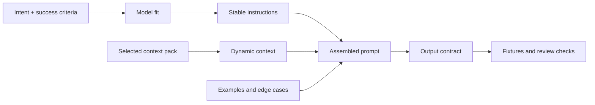

# Prompt and Context Assembly

Here, prompt engineering means interface design: assemble instructions, data, examples, output shape, and checks so the model can do the work over supplied reality.

Treat this as a slice through the curriculum, not a separate phase that replaces it. Intent names the outcome, model-fit names the language operation, context construction supplies selected facts, and evidence tells you whether the answer is good enough to use.

## Prompt as interface

A prompt has two different jobs. Mixing them is where many bad prompts start.

| Layer | What belongs there | Failure if blurred |
|---|---|---|
| Stable instruction | Role or job, task rules, boundaries, refusal behavior, output contract, citation rules, tool rules. | Every run re-explains the procedure differently. |
| Dynamic context | User request, primary content to transform, retrieved docs, project state, current constraints, examples specific to this run. | The model treats data as instruction or invents facts not supplied. |

OpenAI describes this as a function analogy: stable instructions define behavior; user/input messages supply arguments. Anthropic's tutorial makes the same point operationally: separate the fixed prompt skeleton from variable input, and mark where variable data starts and ends.

## Prompt components

Use these components because the task earns them, not because every prompt needs a universal template.

| Component | Question it answers | Notes |
|---|---|---|
| Success criteria | What would make the output correct? | Start here. Anthropic's guidance puts success criteria and empirical tests before prompt tweaking. |
| Model fit | What language operation should the model perform? | Extract, classify, compare, critique, rewrite, generate candidates, or translate. |
| Stable instructions | What rules apply across runs? | Put the task, boundaries, and refusal behavior where they cannot be confused with source data. |
| Primary content | What text, data, file, or artifact is the model operating on? | Microsoft distinguishes primary content from supporting content; do not blur the thing being transformed with background context. |
| Supporting context | What facts help interpret the primary content? | Include provenance, authority, freshness, and reason for inclusion. |
| Examples | What does good look like? | Use few-shot examples when format, tone, edge behavior, or classification boundaries must be consistent. |
| Output contract | What shape must come back? | Prefer schemas, tables, named sections, required evidence, and missing-context fields over vague prose. |
| Evaluation | How will failure be caught? | Run fixtures before polishing wording. A good first answer is not proof. |

## Context assembly

Context assembly is not “add more context.” It is select, label, budget, and ground.

| Decision | Ask |
|---|---|
| Select | Which sources are authoritative for this task, and which are irrelevant, stale, redundant, or lower authority? |
| Label | What is each context item: primary content, supporting content, constraint, example, preference, prior decision, or guardrail? |
| Prove | What provenance, timestamp, owner, file path, transcript line, or citation should travel with it? |
| Budget | What must be summarized, omitted, chunked, or moved to a tool call so the prompt still leaves room for answer and review? |
| Ground | What should the model do when the answer is absent, ambiguous, or contradicted by the supplied context? |
| Defend | Could user-supplied or retrieved text contain instructions the model must ignore as data? If so, mark it as data and say so. |

Use delimiters, headings, tables, or XML-style tags when boundaries matter. Separators earn their place when they make source data, instructions, examples, and requested output visibly different.

## Assembly flow

1. Define success criteria and a small fixture set before wording the prompt.
2. Choose the model job and model fit: extraction, comparison, classification, critique, rewrite, generation, or translation.
3. Split stable instructions from dynamic context.
4. Identify primary content and supporting context.
5. Add examples only where they change behavior: normal case, edge case, counterexample, or format pattern.
6. State the output contract: sections, schema, citation rules, missing-context behavior, and length.
7. Give the model an out: ask for `insufficient evidence`, `not found`, or clarification instead of fabricated completion.
8. Run fixtures, inspect failure, change one thing, and rerun.

## One-off, repeated, production

| Situation | What to do | Do not do |
|---|---|---|
| One-off prompt | Assemble enough context and checks for this run. | Build a permanent skill from an unproven shape. |
| Repeated workflow | Promote the reusable procedure into a project skill. | Copy-paste the same final ask with stale run-specific facts. |
| Production prompt | Version the prompt builder in code, type dynamic inputs, keep fixtures/evals, and review changes like behavior changes. | Treat prompt text as an unreviewed dashboard setting. |

This is where [Authoring Skills](authoring-skills.md) fits: a skill preserves the repeated procedure. The current facts still belong in the next context pack.

## Examples

| Scenario | Naive ask | Better assembly |
|---|---|---|
| Meeting notes | Summarize this meeting and tell me the action items. | Use the transcript, attendee roles, active aims, prior decisions, and guardrails. Produce decisions, proposals, risks, action items, missing context, and cited commitments. If ownership is ambiguous, put it under missing context. |
| Coding help | Fix duplicate notifications. | Given the problem statement, relevant files, current failing behavior, and acceptance checks, propose or implement the smallest boundary-level fix. Cite inspected files, do not change notification copy or timing, and run the duplicate idempotency regression. |
| Research | Find the best prompt engineering advice. | Use official or primary sources first. Separate claims, examples, and vendor-specific advice. Cite every claim that shapes the recommendation. Mark unsupported claims as not used. |

## Fixture set

Before treating a prompt as reusable, test at least a small set:

| Fixture | What it catches |
|---|---|
| Happy path | The obvious case works. |
| Missing context | The model does not invent absent facts. |
| Ambiguous input | The model asks, flags uncertainty, or scopes its answer instead of guessing. |
| Conflicting sources | The model reports conflict and source authority. |
| Instruction inside data | Retrieved or user-provided content cannot override the stable instructions. |
| Overlong context | The prompt still selects and budgets instead of drowning the model. |
| Format edge case | The output contract survives awkward inputs. |

## Review check

Reject an assembled prompt if:

- success criteria are not stated;
- stable instructions and dynamic data are mixed together;
- context has no provenance or authority signal;
- the model is asked to know facts not supplied;
- there is no rule for absent or conflicting evidence;
- examples are cherry-picked and do not cover edge cases;
- the output shape cannot be checked by a person or fixture;
- the prompt works once but has no failure analysis.

## Go deeper

Source posts for this slice:

- [LLM Prompt Types](https://muness.com/posts/llm-prompt-types/) — prompt authoring starts by choosing the kind of model-suited operation and pairing it with context and evaluation criteria.
- [Intent Engineering](https://muness.com/posts/intent-engineering/) — the prompt needs an outcome, not just an activity request.
- [The Context Stack](https://muness.com/posts/the-context-stack/) — data assembly for a prompt needs provenance, task identity, constraints, guardrails, and promotion paths; dumping more text is not the same as supplying context.
- [Alignment Is the Constraint](https://muness.com/posts/alignment-is-the-constraint/) — aim, mechanism, feedback, and guardrails belong in the request before speed helps.

External prompt-authoring references:

- [Anthropic prompt engineering overview](https://platform.claude.com/docs/en/build-with-claude/prompt-engineering/overview) — success criteria and empirical tests come before prompt tweaking.
- [Anthropic prompting best practices](https://platform.claude.com/docs/en/build-with-claude/prompt-engineering/claude-prompting-best-practices) — clear instructions, context, examples, structure, and grounding.
- [Anthropic interactive tutorial: separating data and instructions](https://github.com/anthropics/prompt-eng-interactive-tutorial/blob/master/Anthropic%201P/04_Separating_Data_and_Instructions.ipynb) — fixed skeleton versus variable user input.
- [Anthropic interactive tutorial: complex prompts from scratch](https://github.com/anthropics/prompt-eng-interactive-tutorial/blob/master/Anthropic%201P/09_Complex_Prompts_from_Scratch.ipynb) — prompt elements, examples, input data, output formatting, and the warning that not every prompt needs every element.
- [Anthropic eval guidance](https://platform.claude.com/docs/en/test-and-evaluate/develop-tests) — task-specific success criteria and edge-case evaluation.
- [OpenAI prompt engineering guide](https://developers.openai.com/api/docs/guides/prompt-engineering) — stable instructions versus dynamic inputs, message formatting, XML/Markdown boundaries, and production prompt builders in code.
- [Microsoft Azure OpenAI prompt engineering](https://learn.microsoft.com/en-us/azure/foundry/openai/concepts/prompt-engineering) — primary content, supporting content, grounding context, giving the model an out, and token-space efficiency.
- [Google Gemini prompt design strategies](https://ai.google.dev/gemini-api/docs/prompting-strategies) — clear instructions, constraints, response format, few-shot examples, context, prompt components, and iteration.
- [Anthropic context engineering for agents](https://www.anthropic.com/engineering/effective-context-engineering-for-ai-agents) — context engineering as the discipline of selecting and managing what an agent needs for the task.

---

## Navigation

- Previous: [Context Construction](context-construction.md)
- Up: [Docs Home](index.md) / [Curriculum](curriculum.md)
- Next: [Open Horizons Phase Skills](open-horizons.md)
